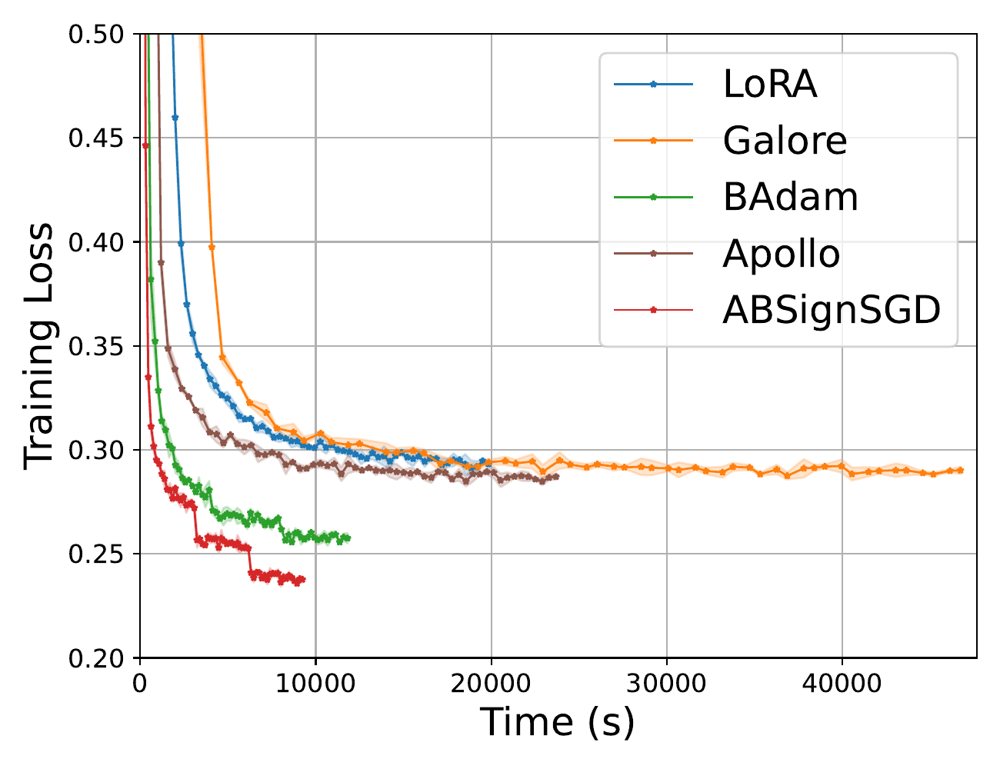

# ABSignSGD

**ABSignSGD** (Arbitrary-order Block SignSGD) is a memory-efficient and fast optimizer for full-parameter transformer fine-tuning. It combines block-wise updates (one transformer layer per step) with sign-based descent, which makes it especially well-suited to memory-constrained training.

[Paper (OpenReview)](https://openreview.net/forum?id=NQsdnYkCar)

## Why ABSignSGD

- **~1/9 memory vs AdamW** (paper analysis, excluding activations): `2M + M/(8N)` vs `18M` for mixed-precision Adam-style training
- **>2x faster than LoRA** in the reported Qwen3-8B benchmark (`2.66h` vs `5.51h`)
- **Practical**: implemented as a `torch.optim.Optimizer` subclass and works with standard PyTorch schedulers

## Algorithm

At step `k`, ABSignSGD selects one block (layer), computes its gradient, and applies a sign update only to that block.

Equivalent update rule:

```latex
for k = 0, 1, 2, ...
    select block i_k
    v = sign(g_{i_k}(x^k))
    x^{k+1}_{i_k} = x^k_{i_k} - lr * v
    x^{k+1}_i = x^k_i  for all i != i_k
end
```

This implementation supports:

- `selection_scheme="depth_biased"` (default)
- `selection_scheme="uniform"`

The depth-biased scheme updates deeper layers more frequently, which reduces average backprop cost in practice.

## Reported Results

### Runtime convergence (wall-clock)

<p align="center">
  
</p>


<p align="center"><em>Wall-clock convergence for Qwen3-8B fine-tuning on OpenMathInstruct-2. ABSignSGD reaches lower training loss faster than the compared baselines.</em></p>

### Memory / runtime comparison (Table 2)

Qwen3-8B fine-tuning on 50K OpenMathInstruct-2 samples for 3 epochs (from the paper’s Table 2):

| Method | Peak reserved GPU memory (GB) | Runtime (h) |
| --- | ---: | ---: |
| **ABSignSGD** | **20.29** | **2.66** |
| LoRA | 22.54 | 5.51 |
| GaLore | 23.47 | 12.77 |
| BAdam | 23.19 | 3.32 |
| Apollo | 22.58 | 6.64 |

ABSignSGD is the fastest method in this comparison and uses the lowest peak reserved GPU memory.

## Installation

Install the minimal dependencies (and `transformers` if you want to run the examples below):

```bash
pip install torch numpy transformers
```

Then import the optimizer directly from this repo (or copy `absignsgd.py` into your project):

```python
from absignsgd import ABSignSGD
```

## Usage

### FP32 usage (standard optimizer loop)

Use `fp16=False` for standard FP32 training. For BF16 models, also use `fp16=False` (BF16 does not require gradient scaling).

```python
import torch
from transformers import AutoModelForCausalLM
from absignsgd import ABSignSGD

device = torch.device("cuda")
model = AutoModelForCausalLM.from_pretrained(
    "gpt2",
    torch_dtype=torch.float32,  # or torch.bfloat16
).to(device)

optimizer = ABSignSGD(
    model=model,
    lr=1e-4,
    fp16=False,
    depth_bias=10.0,
    selection_scheme="depth_biased",
    weight_decay=0.01,
)

model.train()
for batch in dataloader:
    batch = {k: v.to(device) for k, v in batch.items()}
    outputs = model(**batch, use_cache=False)
    loss = outputs.loss

    loss.backward()
    optimizer.step()
    optimizer.zero_grad(set_to_none=True)
```

### FP16 usage (important: different from the usual `GradScaler` pattern)

When `fp16=True`, `ABSignSGD` creates and uses an internal scaler (`optimizer.scaler`).

Use this pattern:

```python
import torch
from transformers import AutoModelForCausalLM
from absignsgd import ABSignSGD

device = torch.device("cuda")
model = AutoModelForCausalLM.from_pretrained(
    "gpt2",
    torch_dtype=torch.float16,
).to(device)

optimizer = ABSignSGD(model=model, lr=1e-4, fp16=True)
scaler = optimizer.scaler

model.train()
for batch in dataloader:
    batch = {k: v.to(device) for k, v in batch.items()}
    outputs = model(**batch, use_cache=False)
    loss = outputs.loss

    scaler.scale(loss).backward()
    optimizer.step()          # do NOT call scaler.step(optimizer)
    scaler.update()
    optimizer.zero_grad(set_to_none=True)
```

FP16 notes:

- Use `optimizer.scaler` (do not create a separate scaler)
- Call `optimizer.step()` directly (not `scaler.step(optimizer)`)
- Call `scaler.update()` after `optimizer.step()`

## Schedulers

`ABSignSGD` subclasses `torch.optim.Optimizer`, so PyTorch schedulers work as usual:

```python
scheduler = torch.optim.lr_scheduler.LambdaLR(optimizer, lr_lambda)

for batch in dataloader:
    ...
    optimizer.step()
    optimizer.zero_grad(set_to_none=True)
    scheduler.step()
```

## API

```python
ABSignSGD(
    model: torch.nn.Module,
    lr: float = 1e-3,
    depth_bias: float = 10.0,
    selection_scheme: Literal["depth_biased", "uniform"] = "depth_biased",
    fp16: bool = True,
    weight_decay: float = 0.01,
    gradient_clipping: Optional[float] = None,
)
```

Parameter notes:

- `depth_bias`: depth-biased scheduling strength (paper default: `10.0`)
- `selection_scheme`: `"depth_biased"` or `"uniform"`
- `fp16`: enables the internal `GradScaler` path
- `weight_decay`: applied before the sign update
- `gradient_clipping`: disabled when `None` (internally treated as `0.0`)

## Supported Transformer Layer Layouts

Layer count and layer parameters are auto-detected internally. You do not need to call `get_num_layers()` for normal usage.

Common supported patterns include:

- `model.layers`
- `transformer.h`
- `gpt_neox.layers`
- `decoder.layers`
- `model.decoder.layers`
- `transformer.blocks`
- `blocks`
- `h`
- `transformer.layers`

If your model uses a different naming convention, extend the layer detection patterns in `absignsgd.py`.

## Citation

If you use ABSignSGD, please cite:

```
@inproceedings{
zhou2026arbitraryorder,
title={Arbitrary-Order Block Sign{SGD} for Memory-Efficient {LLM} Fine-Tuning},
author={Yijie Zhou and Shi Pu},
booktitle={The Fourteenth International Conference on Learning Representations},
year={2026},
url={https://openreview.net/forum?id=NQsdnYkCar}
}
```
